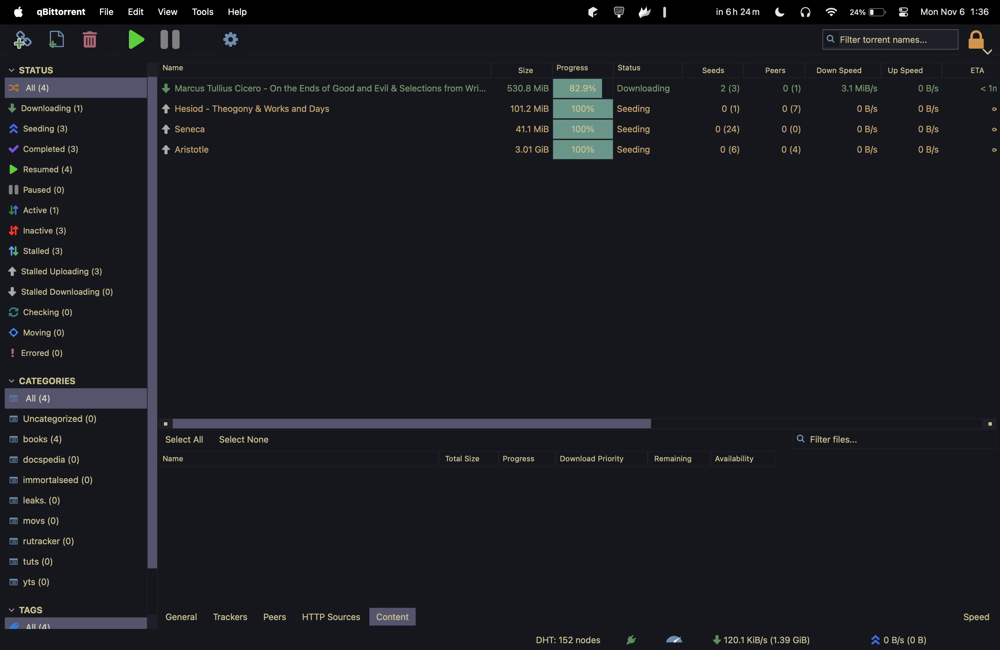

<h1 align="center">
  the kanagawa theme for qBittorrent
</h1>

> ⚠️ seeking contributions: [icons needed](#contributing)

  
   
  <i>colorscheme: kanagawa • qBittorrent</i>

## seeking contributions: icons needed!

**We're on the lookout for contributors!** 🚀

- **Especially for icon design:** Tailored to match the Kanagawa theme's pastel tones.
- **Make an impact:** Your icons are the missing pieces to complete our aesthetic puzzle.

Jump in and help us craft a cohesive and visually appealing experience for qBittorrent users!

## colorscheme

  
  

    For qBittorrent, I've taken the plunge with the <a href="https://github.com/rebelot/kanagawa.nvim">kanagawa</a> theme, which stands out as an exceptionally refined colorscheme. 
    It's one of the most perfect colorschemes I've come across of late. I was enjoying how pleasant Gruvbox was to the eye and yet wanted something darker. 
    I will be using a darker configuration of it extensively throughout my rice, all of which can be 
    found in the <a href="https://github.com/esskayesss/dots"> <code>dots</code></a> repository. A big shout-out to the creator for making the palette public.
  

## contributing

**We're on the lookout for contributors!** 🚀

- **Especially for icon design:** Tailored to match the Kanagawa theme's pastel tones.
- **Make an impact:** Your icons are the missing pieces to complete our aesthetic puzzle.

Jump in and help us craft a cohesive and visually appealing experience for qBittorrent users!
We look forward to seeing your creative contributions. Together, we can make the Kanagawa theme for qBittorrent even more beautiful and user-friendly!
